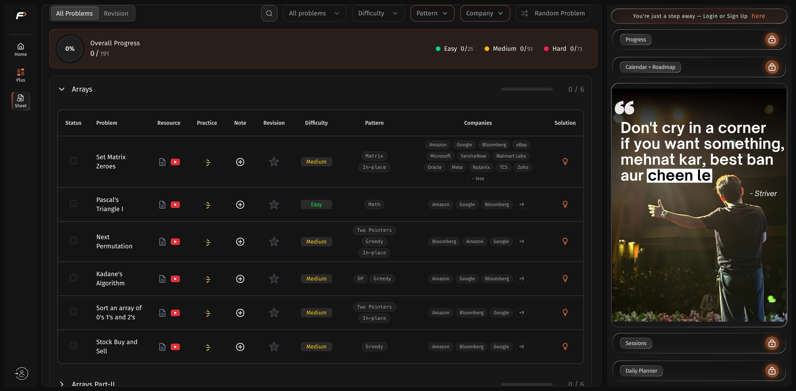

# TUF SDE Sheet Enhancer

A Chrome extension that upgrades [Striver's SDE Sheet](https://takeuforward.org/dsa/strivers-sde-sheet-top-coding-interview-problems)
with **pattern and company tags for all 191 problems** — see which technique each
problem's optimal solution uses, which companies ask it, and filter by either.

## Features

- **Pattern column** — tags for the pattern(s) each optimal solution uses
  (`Sliding Window`, `Hashing`, `Monotonic Stack`, …).
- **Companies column** — the top companies asking each problem; click `+N` to
  expand the full list, `− less` to collapse.
- **Everything filters** — click any chip, or use the **Pattern** (nested by
  DS/algo family) and **Company** (sorted by count) toolbar dropdowns. Filters
  combine, e.g. Sliding Window problems asked at Google. Sections auto-expand
  while filtering and restore on clear.
- **Solution column** — a lightbulb opens a modal with the optimal approach,
  time complexity, and a link to the free editorial.
- **Declutters** — hides the "Plus" / "Resource Plus" (paid-course) columns.

## Install

1. Clone or download this repository.
2. Open `chrome://extensions`, enable **Developer mode**.
3. Click **Load unpacked**, select the repository folder, and open the
   [SDE sheet](https://takeuforward.org/dsa/strivers-sde-sheet-top-coding-interview-problems).

## Data

- **Patterns** (`data.js`): all 191 problems hand-categorized across 13 DS/algo
  families and 52 pattern tags, by the problem's nature rather than its sheet
  section. Each entry also has a one-line approach and time complexity.
- **Companies** (`companies.js`): 174 problems tagged, from LeetCode's company
  tags for the **last six months** of interview reports (via the public
  [leetcode-company-wise-problems](https://github.com/liquidslr/leetcode-company-wise-problems)
  dataset, mapped problem-by-problem in `tools/tuf-lc-map.js`) plus
  GeeksforGeeks tags for problems not on LeetCode (`tools/gfg-tags.json`).
  Ranked by ask-frequency weighted by company size, capped at 12 per problem.
  Regenerate with `tools/build-index.js` + `tools/gen-companies.js` (see the
  comments in those files).

`content.js` injects the columns and dropdowns, matches rows by normalized title
(`TUF_ALIASES` covers renames), and re-applies via a `MutationObserver` since the
sheet re-renders. Styling uses the site's own CSS variables, so it follows the
site theme.

## Disclaimer

Unofficial, personal-use extension — not affiliated with takeUforward. Purely a
client-side overlay: nothing is collected or sent anywhere, and editorial links
point to takeuforward's free articles. Company tags come from community datasets
and are indicative, not authoritative.

## License

[MIT](LICENSE)
